# Personal SQL Guide Book

**Author:** Ogechukwu Ezenwa  
**Date:** October 20, 2025  
**Course:** IDS 706 – Data Engineering Systems  
**Assignment:** Build Your Personal SQL Guidebook
---

## Overview


## Project Structure 
```bash
.
├── .devcontainer
│   ├── devcontainer.json
│   └── docker-compose.yml
├── README.md
├── data
│   └── classicmodels.db
└── scripts
    └── basic_queries.sql
    └── create_table.sql
    
```

## Usage

1. Clone this repository:
    ```bash
    git clone <repository-url>
    ```
2. This project uses a devcontainer to provide a consistent development 
environment. When prompted, select “Reopen in Container.”  
    - All required extensions and packages for database access are pre-installed and configured automatically. 
    - By reopening the project in a compatible editor like VS Code and selecting “Reopen in Container,” you’ll have immediate access to all necessary tools—such as database drivers, CLI utilities, and VS Code extensions ensuring a smooth and reliable setup for development and analysis.
3. Browse the `scripts` directory for categorized SQL scripts.
4. The database can be found in `data` directory.
4. Copy and adapt queries as needed for your database.

## Requirements

- A SQL-compatible database (e.g. SQLite)
- Access to a database client or management tool (e.g SQLite Viewer)
- If sqlite3 isn't working on the terminal or isn't installed when using `devcontainer`, use the code below.

    ```bash
    sudo apt-get update && sudo apt-get install -y sqlite3
    ```

## Create database and Populate Tables

The `classicmodels.db` database is a retailer of scale models of classic cars. It contains typical business data, including information about customers, products, sales orders, sales order line items, and more. This is data set is found here [classicmodels.db](https://www.mysqltutorial.org/getting-started-with-mysql/mysql-sample-database/#:~:text=the%20following%20link%3A-,Download%20MySQL%20Sample%20Database,-The%20download%20file).

###  *This is run on the terminal to create the database*

```bash
sqlite3 classicmodels.db
```

### *If you already created the table and want to update it, use the `DROP TABLE IF EXISTS` command to avoid errors.*

```sql
DROP TABLE IF EXISTS productlines;
DROP TABLE IF EXISTS products;
DROP TABLE IF EXISTS offices;
DROP TABLE IF EXISTS employees;
DROP TABLE IF EXISTS customers; 
DROP TABLE IF EXISTS payments;
DROP TABLE IF EXISTS orders;
DROP TABLE IF EXISTS orderdetails;
```

### *To create tables in the database run the `CREATE TABLE` command* and to `INSERT INTO` populate the tables with row information.

```sql
CREATE TABLE offices (
  officeCode TEXT PRIMARY KEY,
  city TEXT NOT NULL,
  phone TEXT NOT NULL,
  addressLine1 TEXT NOT NULL,
  addressLine2 TEXT,
  state TEXT,
  country TEXT NOT NULL,
  postalCode TEXT NOT NULL,
  territory TEXT NOT NULL
);

INSERT INTO offices (
  officeCode, city, phone, addressLine1, addressLine2, state, country, postalCode, territory
) VALUES
('1','San Francisco','+1 650 219 4782','100 Market Street','Suite 300','CA','USA','94080','NA'),
('2','Boston','+1 215 837 0825','1550 Court Place','Suite 102','MA','USA','02107','NA'),
('3','NYC','+1 212 555 3000','523 East 53rd Street','apt. 5A','NY','USA','10022','NA'),
('4','Paris','+33 14 723 4404','43 Rue Jouffroy D''abbans',NULL,NULL,'France','75017','EMEA'),
('5','Tokyo','+81 33 224 5000','4-1 Kioicho',NULL,'Chiyoda-Ku','Japan','102-8578','Japan'),
('6','Sydney','+61 2 9264 2451','5-11 Wentworth Avenue','Floor #2',NULL,'Australia','NSW 2010','APAC'),
('7','London','+44 20 7877 2041','25 Old Broad Street','Level 7',NULL,'UK','EC2N 1HN','EMEA');
```


## Dataset Information
The student record data is found in the `data` folder. This is a sample data (not an actual data) to help you practice sql queries quickly and effectively.

This is the list of tables found in student record database.
- `customers`: stores customer’s data.
- `products`: stores a list of scale model cars.
- `productlines`: stores a list of product lines.
- `orders`: stores sales orders placed by customers.
- `orderdetails`: stores sales order line items for every sales order.
- `payments`: stores payments made by customers based on their accounts.
- `employees`: stores employee information and the organization structure such as who reports to whom.
- `offices`: stores sales office data.

### *Before you start running sql queries you can run this `.tables` to get the list of tables in the databse and `.schema` to get the metadata about the database schema.*

```sql
.tables
```


```
-- to see the schema including tables and indices
.schema
```


## Running basic queries

### *`COUNT`the number of rows. Use `AS` is used to rename columns*
```sql
SELECT COUNT(*) AS total
FROM productlines;
```


### *Find the unique rows in a column using `DISTINCT`*
```sql
SELECT COUNT(DISTINCT country) AS unique_countries
FROM customers;
```


### *`UPDATE` rows in tables and include `WHERE` clause to specify the condition.*

```sql
UPDATE employees
SET jobTitle = 'Senior Sales Rep'
WHERE firstName = 'Leslie' AND lastName = 'Thompson';
```
### *Run `SELECT` * to fetch all columns fromt the students tables. Use `FROM` to choose the table and `WHERE` to filter rows based on a condition.*

```sql
SELECT * 
FROM employees
WHERE lastName = 'Thompson' AND firstName = 'Leslie';
```


```sql
SELECT customerName, country, creditLimit
FROM customers
WHERE country = 'USA' AND creditLimit > 50000;
```
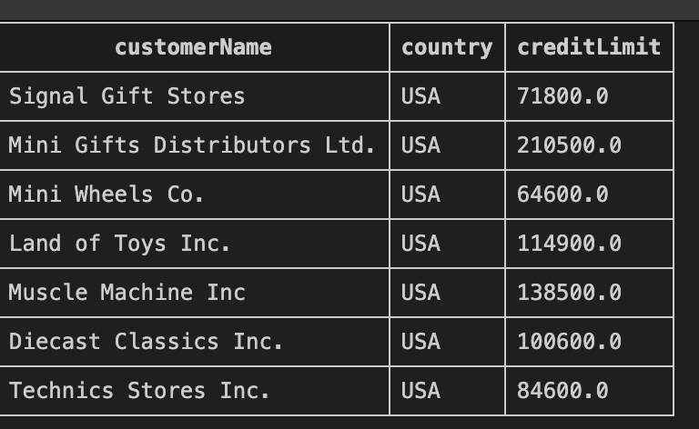

### *Use `ORDER BY` to sort results by one or more columns*
```sql
SELECT productName, buyPrice, quantityInStock
FROM products
ORDER BY buyPrice DESC;
```


### *Use `GROUP BY` to aggregate rows that share a common value*

```sql
SELECT country, COUNT(customerNumber) AS num_customers
FROM customers
GROUP BY country;
```


### *Restrict the number of rows returned using `LIMIT`*

```sql
SELECT customerName, country, creditLimit
FROM customers
LIMIT 10;
```
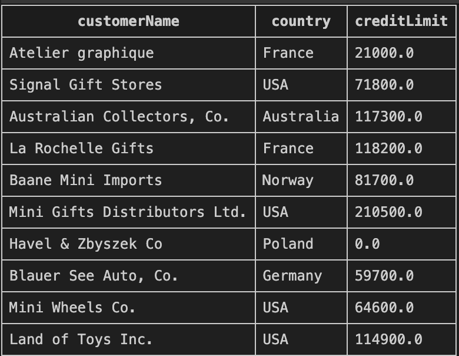

### *Filter results after aggregation (works like WHERE but on grouped data) using `HAVING`*
```sql
SELECT country, COUNT(customerNumber) AS num_customers
FROM customers
GROUP BY country
HAVING num_customers > 2;
```
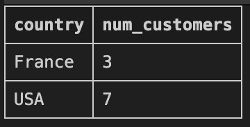


### *Calculate the average value of a numeric column*
```sql
SELECT AVG(creditLimit) AS avg_credit_limit
FROM customers;
```
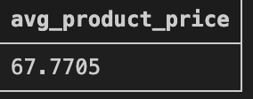

### *Get the higest or lowest value using `MAX` or `MIN`*
```sql
SELECT MAX(amount) AS max_payment
FROM payments;
```
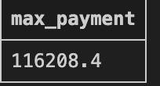

```sql
SELECT MIN(quantityInStock) AS min_stock
FROM products;
```


### *Using `SUM` add numeric values across rows*
```sql
SELECT SUM(amount) AS total_payments
FROM payments;
```
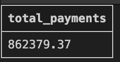


### *Aggregate functions are most powerful with `GROUP BY`*
```sql
-- Number of customers per country
SELECT country, COUNT(customerNumber) AS num_customers
FROM customers
GROUP BY country
ORDER BY num_customers DESC;

-- Average payment per customer
SELECT customerNumber, AVG(amount) AS avg_payment
FROM payments
GROUP BY customerNumber
ORDER BY avg_payment DESC;
```

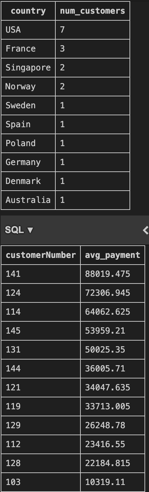

## Running advanced queries

`JOIN`s are one of the most important SQL concepts for combining tables.

### *`INNER JOIN` returns rows when there is a match in both tables*
### U
```sql
SELECT c.customerName, e.firstName, e.lastName
FROM customers c
INNER JOIN employees e
    ON c.salesRepEmployeeNumber = e.employeeNumber;
```
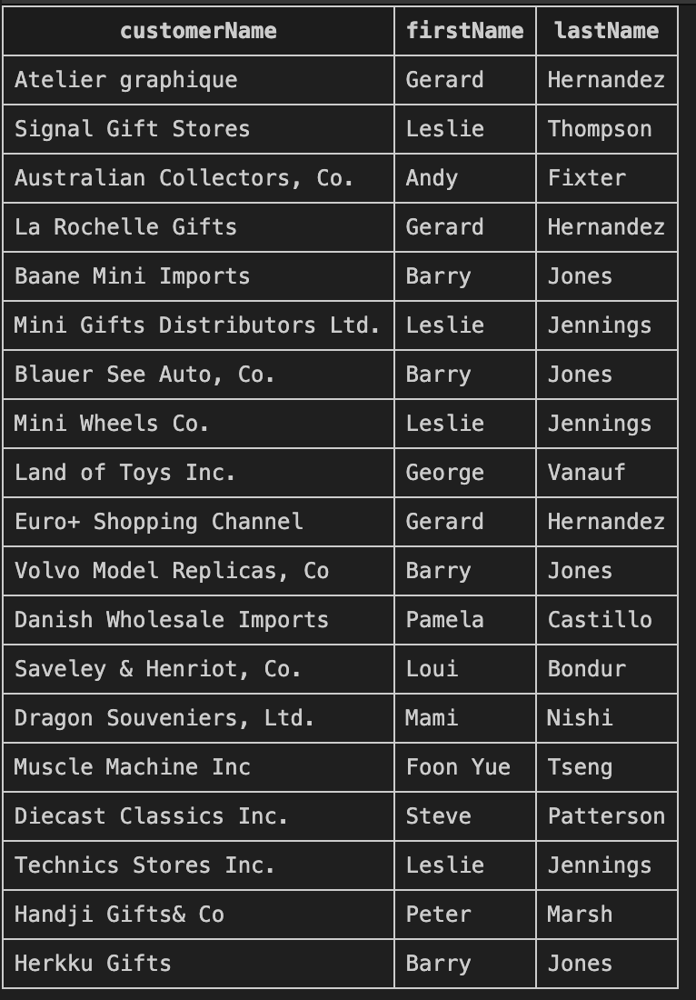

- Get all customer names with their sales rep's full name
- Only customers who have a sales rep will appear 
- If salesRepEmployeeNumber is NULL, they won’t show.

### *`LEFT JOIN` returns all rows from the left table with corresponding rows from the right table, even if there's no match in the right table. `NULL`s are returned as values for the 2nd table* 

```sql
SELECT c.customerName, e.firstName, e.lastName
FROM customers c
LEFT JOIN employees e
    ON c.salesRepEmployeeNumber = e.employeeNumber;
```
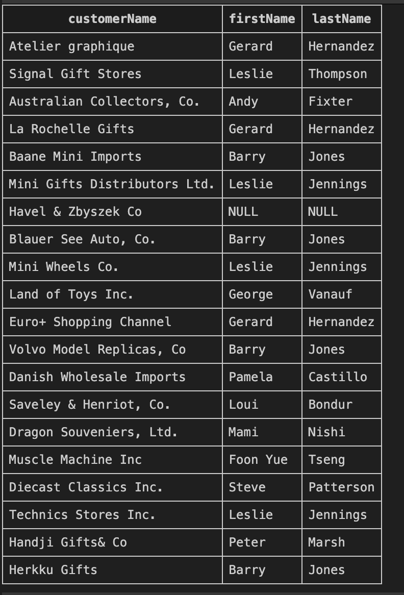

- List all customers and their sales reps (include customers with no assigned rep)
- Customers without a sales rep will still show, but the employee columns will be NULL.

### *SQLite does not support `RIGHT JOIN` directly. But you can simulate it by flipping the tables in a `LEFT JOIN`.

```sql
SELECT c.customerName, e.firstName, e.lastName
FROM employees e
LEFT JOIN customers c
    ON c.salesRepEmployeeNumber = e.employeeNumber;
```
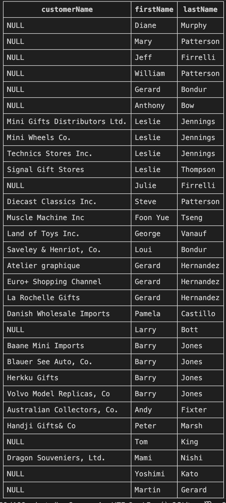

- Simulate RIGHT JOIN for customers and employees by reversing the order of the tables
- This ensures you get all employees, even if they don’t manage any customers.

### *`FULL OUTER JOIN` returns all rows from both tables - if there's is not matching row in the second table, `NULL`s are returned.

```sql
SELECT c.customerName, e.firstName, e.lastName
FROM customers c
FULL OUTER JOIN employees e
    ON c.salesRepEmployeeNumber = e.employeeNumber;
```
- Combine customers with reps + reps without customers

### *`CROSS JOIN` should be used carefully. It is a form of cartesian product where every row from table A is combined with every row from table B.*

```sql
SELECT c.customerName, o.city
FROM customers c
CROSS JOIN offices o;
```
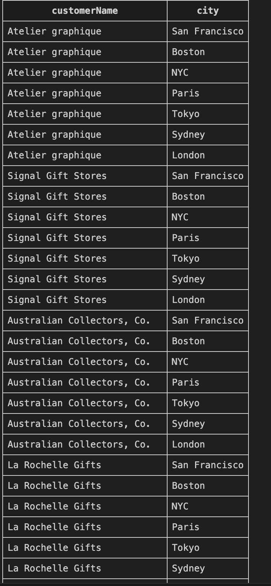

- Pair all customers with all offices (demo only).
- If you have 20 customers and 7 offices → result = 140 rows.

### *`JOIN` with multiple tables. You can chain joins to connect 3+ tables*

```sql
SELECT o.orderNumber, c.customerName, e.firstName || ' ' || e.lastName AS salesRep
FROM orders o
INNER JOIN customers c ON o.customerNumber = c.customerNumber
INNER JOIN employees e ON c.salesRepEmployeeNumber = e.employeeNumber;

```

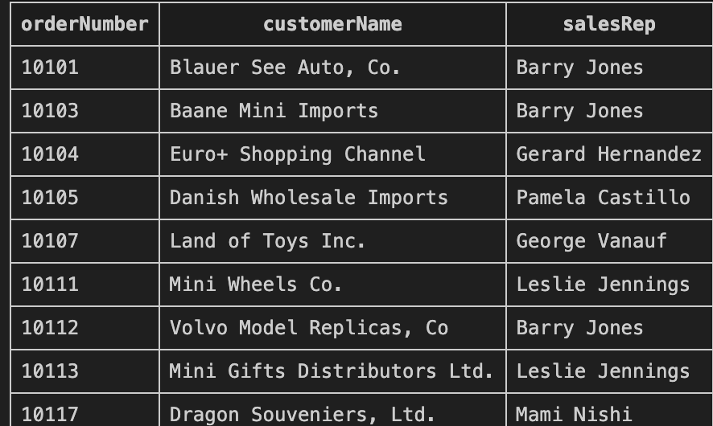

- List order numbers, customer names, and sales rep names.
- With these joins, you’ll be able to handle multi-table queries in ClassicModels easily.

